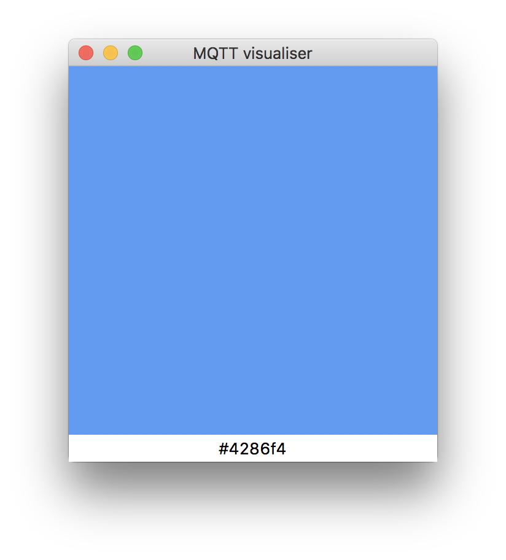

# MQTT ambilight

Docker application to get the average color of a webcam/video capture device and broadcast it over MQTT

## How to use

Get it on DockerHub:

- Regular version: [https://hub.docker.com/r/whitebird/mqtt-ambilight-rpi/](https://hub.docker.com/r/whitebird/mqtt-ambilight-rpi/)
- Raspberry Pi version: [https://hub.docker.com/r/whitebird/mqtt-ambilight/](https://hub.docker.com/r/whitebird/mqtt-ambilight/)

To run the application:

- Copy `configuration.example.yaml` to `configuration.example.yaml` and add your mqtt details.
- Run it with a command like this: 

```
docker run -it \
    -v ~/mqtt-ambilight/configuration.yaml:/configuration.yaml \
    --device=/dev/video0:/dev/video0 \
    --net="host" \
    -t mqtt-ambilight
```

## Debugging

There is a testing application in the `tester` directory that connects with the mqtt details in `configuration.yaml`. It shows a window with the published as the background color.

To use it you need to install the dependencies in `requirements.txt` with: `pip install -r requirements.txt`. Then run it with `python main.py`.

Note: The tester tool is built with tkinter so it needs a desktop environment to work.


